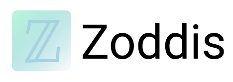

# Zoddis: Client-server application template generator.



[](https://github.com/makridenko/zoddis/blob/master/LICENSE)

## This is Zoddis.

Zoddis is a client-server application template generator. Stack of generated application is:
  - [Django](https://github.com/django/django)
  - [Graphene](https://github.com/graphql-python/graphene)
  - [React](https://github.com/facebook/react)
  - [Relay](https://github.com/facebook/relay)
  - [Docker](https://www.docker.com/)
  - [docker-compose](https://docs.docker.com/compose/)
  
------------------

## Installation

Before installing Zoddis, please install [django-admin](https://github.com/django/django) and [create-react-app](https://github.com/facebook/create-react-app) utils.

- **Install Zoddis from the GitHub source:**

First, clone Zoddis using `git`:
```sh
git clone https://github.com/makridenko/zoddis.git
```

Then, `cd` to the Zoddis folder and run the install command:
```sh
sudo python3 setup.py install
```

------------------

## Usage

There are only two commands:
  - `help`
  - `gen`

`help` command will show you a help message:
```sh
zds -h
```
or
```sh
zds --help
```

`gen` command will generate your project
```sh
zds gen -t <project_name> -b <backend_server_port> -f <frontend_server_port>
```

For example:
```sh
zds gen -t my-awesome-project -b 21010 -f 21020
```
